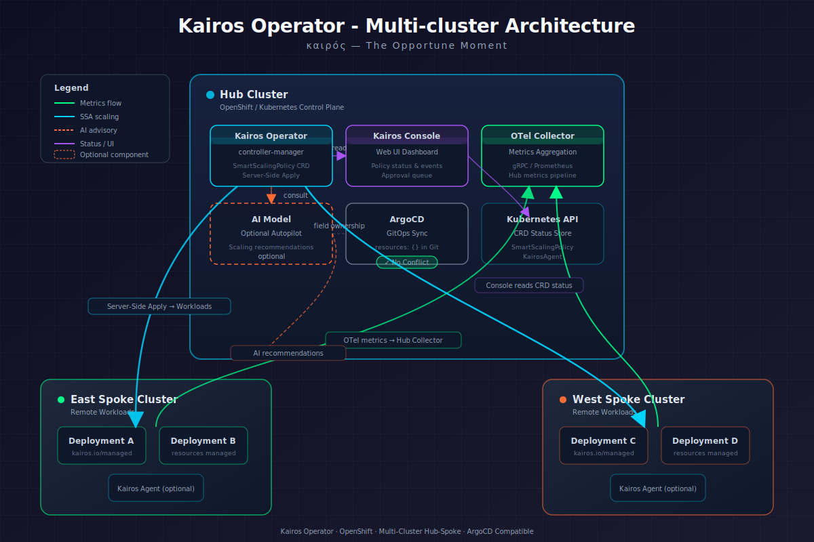
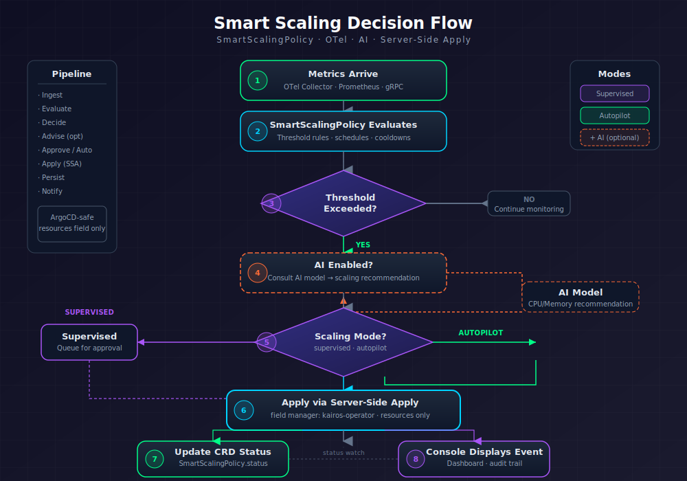

# Kairos Operator

<div align="center">
  
  
  ### καιρός — *The Opportune Moment*
  
  > *"Kairos is the fleeting moment of opportunity — the instant when conditions align perfectly for action. In infrastructure, it's the precise moment to scale before latency spikes, and to release resources before waste accumulates."*

  [](https://github.com/maximilianoPizarro/kairos/actions/workflows/ci.yaml)
  [](LICENSE)
  [](https://sdk.operatorframework.io/)
</div>

---

OpenShift operator for **intelligent resource management** with OpenTelemetry metrics and optional AI-powered autopilot. Designed to coexist with ArgoCD in multi-cluster GitOps environments using Server-Side Apply (SSA).

## Architecture



## Scaling Flow



## Features

- **Smart Scaling Policies** — Define metric-based and schedule-based scaling rules as Kubernetes CRDs. Rules evaluate OTel/Prometheus/Thanos metrics and trigger horizontal (replicas) or vertical (CPU/memory) scaling.
- **AI-Powered Agents** — Optional integration with AI models (DeepSeek, Granite, Qwen via vLLM/KServe/LiteLLM) for autonomous resource optimization in autopilot or supervised mode.
- **OpenTelemetry Native** — Reads metrics from OTel Collector via gRPC (OTLP), with Prometheus/Thanos fallback. Compatible with Red Hat build of OpenTelemetry.
- **ArgoCD Compatible** — Uses Server-Side Apply with field ownership to manage only the `resources` field. No sync conflicts with GitOps.
- **Namespace Suffix Filtering** — Watch all namespaces matching a suffix pattern (`-dev`, `-test`, `-qa`, `-prod`) automatically.
- **Multi-cluster Governance Console** — PatternFly 5 dashboard for real-time visualization of agents, policies, and events across clusters.
- **Safe by Design** — Rate limiting, exponential backoff, cooldown periods, approval workflows, and automatic rollback on failure.

## Metrics Integration

Kairos supports three metrics sources (in priority order):

| Priority | Source | Protocol | Use Case |
|---|---|---|---|
| 1 | OpenTelemetry Collector | gRPC/OTLP (port 4317) | Primary — lowest latency, push-based |
| 2 | Thanos Querier | PromQL over HTTPS (port 9091) | Federated multi-cluster metrics |
| 3 | Prometheus | PromQL over HTTP (port 9090) | Single-cluster fallback |

### Configuring with OpenTelemetry

Deploy an `OpenTelemetryCollector` CR that scrapes Thanos and exposes OTLP gRPC:

```yaml
apiVersion: opentelemetry.io/v1beta1
kind: OpenTelemetryCollector
metadata:
  name: kairos-otel
  namespace: kairos-system
spec:
  mode: deployment
  config:
    receivers:
      otlp:
        protocols:
          grpc:
            endpoint: 0.0.0.0:4317
      prometheus:
        config:
          scrape_configs:
          - job_name: thanos-federated
            scrape_interval: 30s
            scheme: https
            tls_config:
              insecure_skip_verify: true
            bearer_token_file: /var/run/secrets/kubernetes.io/serviceaccount/token
            static_configs:
            - targets: ['thanos-querier.openshift-monitoring.svc:9091']
    exporters:
      debug: {}
    service:
      pipelines:
        metrics:
          receivers: [otlp, prometheus]
          exporters: [debug]
```

Then reference it in your SmartScalingPolicy:

```yaml
spec:
  otelEndpoint: "kairos-otel-collector.kairos-system.svc:4317"
  prometheusEndpoint: "https://thanos-querier.openshift-monitoring.svc:9091"
```

### Using Thanos Querier (OpenShift built-in)

OpenShift clusters include Thanos Querier by default. No additional installation required:

```yaml
apiVersion: kairos.maximilianopizarro.github.io/v1alpha1
kind: SmartScalingPolicy
metadata:
  name: my-policy
spec:
  target:
    apiVersion: apps/v1
    kind: Deployment
    name: my-app
    namespace: my-namespace
  prometheusEndpoint: "https://thanos-querier.openshift-monitoring.svc:9091"
  rules:
  - name: cpu-high
    when:
      metric: "container_cpu_usage_seconds_total"
      operator: GreaterThan
      threshold: "0.8"
    action:
      type: AddReplicas
```

## AI Model Configuration

Create a secret with your API key:

```bash
oc create secret generic kairos-ai-credentials \
  -n kairos-system \
  --from-literal=api-key=<your-api-key>
```

Configure the KairosAgent:

```yaml
apiVersion: kairos.maximilianopizarro.github.io/v1alpha1
kind: KairosAgent
metadata:
  name: my-agent
spec:
  mode: autopilot          # or "supervised" for human approval
  aiModel:
    apiURL: "https://litellm-prod.apps.maas.redhatworkshops.io/v1/chat/completions"
    model: "deepseek-r1-distill-qwen-14b"
    secretRef:
      name: kairos-ai-credentials
      key: api-key
  watch:
    namespaceSuffix: "-prod"
    resourceTypes:
    - Deployment
    - StatefulSet
  correctionPolicy:
    maxActionsPerHour: 10
    rollbackOnFailure: true
  reporting:
    interval: "5m"
```

Supported AI endpoints: vLLM, KServe, LiteLLM, Ollama, OpenAI-compatible APIs.

## Namespace Suffix Mode

Instead of listing namespaces manually, define a suffix pattern:

```yaml
spec:
  watch:
    namespaceSuffix: "-prod"   # Watches ALL *-prod namespaces automatically
    resourceTypes:
    - Deployment
    - StatefulSet
```

Available suffix patterns: `-dev`, `-test`, `-qa`, `-prod` (or any custom suffix).

## Quick Start

### Prerequisites

- OpenShift 4.14+ or Kubernetes 1.25+
- Cluster admin access
- Red Hat build of OpenTelemetry (recommended, available via OperatorHub)
- Thanos Querier (included by default in OpenShift monitoring stack)
- (Optional) AI model endpoint for autopilot mode

### Install

```bash
# 1. Install CRDs
oc apply -f config/crd/bases/

# 2. Create namespace, ServiceAccount, and RBAC
oc apply -f config/samples/prereqs.yaml

# 3. Deploy the operator
make deploy IMG=quay.io/maximilianopizarro/kairos-operator:v0.1.0

# 4. Create a scaling policy with Thanos metrics
oc apply -f config/samples/kairos_v1alpha1_smartscalingpolicy.yaml

# 5. (Optional) Deploy AI agent
oc apply -f config/samples/kairos_v1alpha1_kairosagent.yaml

# 6. Deploy the governance console
oc apply -f config/samples/kairos_v1alpha1_kairosconsole.yaml
```

### Mark a workload for Kairos management

```yaml
apiVersion: apps/v1
kind: Deployment
metadata:
  name: my-service
  annotations:
    kairos.io/managed: "true"       # Opt-in to Kairos management
    kairos.io/policy: "my-policy"   # Link to a SmartScalingPolicy
spec:
  template:
    spec:
      containers:
      - name: app
        image: my-image:latest
        resources: {}   # Leave EMPTY - Kairos manages this via SSA
```

## ArgoCD Coexistence

See [docs/argocd-coexistence.md](docs/argocd-coexistence.md) for the complete guide.

**TL;DR:** Leave `resources: {}` empty in your Git manifests, add `kairos.io/managed: "true"` annotation, and configure `ignoreDifferences` in ArgoCD.

## Container Images

| Image | Purpose | Base |
|---|---|---|
| `quay.io/maximilianopizarro/kairos-operator` | Controller manager | UBI9 Micro |
| `quay.io/maximilianopizarro/kairos-console` | Governance dashboard | UBI9 Micro |
| `quay.io/maximilianopizarro/kairos-operator-bundle` | OLM bundle | UBI9 Micro |
| `quay.io/maximilianopizarro/kairos-operator-catalog` | OLM catalog | OPM |

## CRDs

| Kind | Purpose | Key Fields |
|---|---|---|
| `SmartScalingPolicy` | Metric & schedule scaling rules | target, otelEndpoint, prometheusEndpoint, rules, schedule, ai, paused |
| `KairosAgent` | AI autonomous optimization agent | mode, aiModel, watch.namespaceSuffix, correctionPolicy |
| `KairosConsole` | Multi-cluster governance console | route, auth, clusters |

## Development

### Build locally

```bash
# Operator
make docker-build IMG=quay.io/maximilianopizarro/kairos-operator:v0.1.0
make docker-push IMG=quay.io/maximilianopizarro/kairos-operator:v0.1.0

# Console
make docker-build-console
make docker-push-console

# Everything
make release
```

### Run tests

```bash
make test
```

### Generate manifests after type changes

```bash
make generate manifests
```

## Documentation

Full documentation: https://maximilianoPizarro.github.io/kairos

## License

Apache License 2.0
