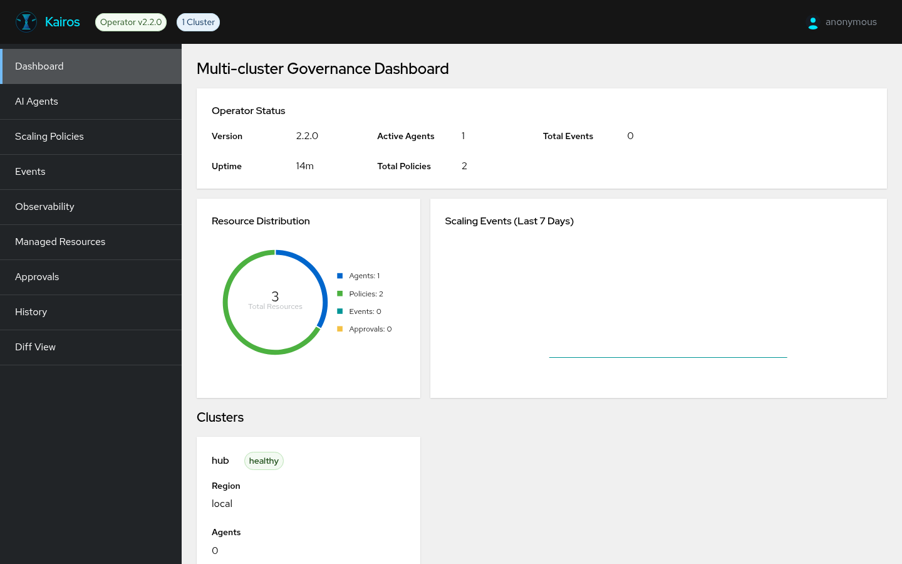
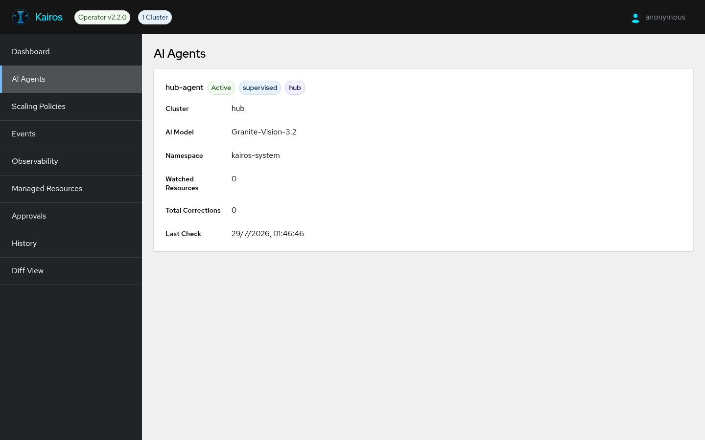
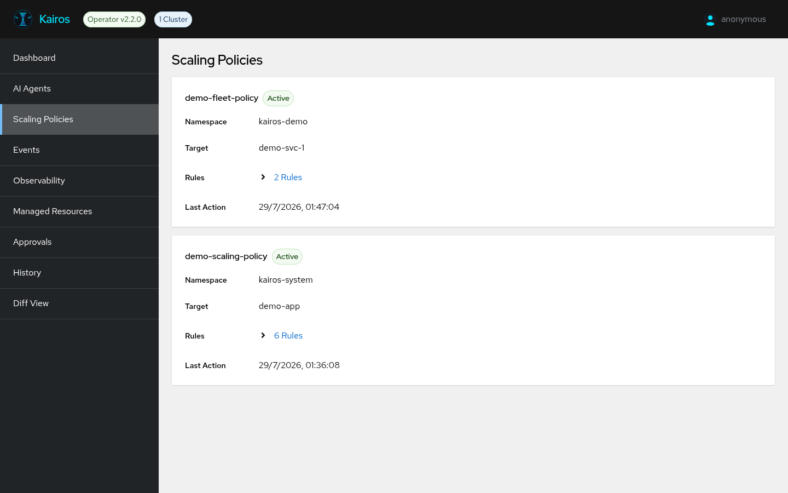
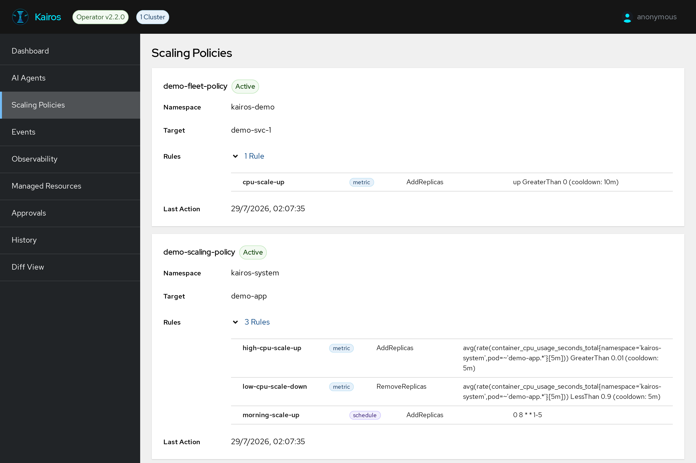

# Kairos Console v2.2.0

Screenshots captured on OpenShift local (CRC) with:

- Operator / Console images: `v2.2.0`
- 1× `KairosAgent` (`hub-agent`) using LiteLLM + **Granite-Vision-3.2**
- 2× `SmartScalingPolicy`
- Demo fleet in `kairos-demo` (8 Deployments, 3 with 1 replica of `pause`)

## Screens

### Dashboard



Shows operator version, uptime, active agents/policies, PatternFly donut chart, and 7-day scaling trend.

### AI Agents



Lists real agents from the cluster API. Model name comes from `spec.aiModel.model` (`Granite-Vision-3.2`).

### Scaling Policies





Expandable rule list with metric PromQL, operator/threshold, action type, and cooldown.

### Other views

| Page | Screenshot |
|---|---|
| Events | [04-events.png](images/screenshots/04-events.png) |
| Observability | [05-observability.png](images/screenshots/05-observability.png) |
| Managed Resources | [06-resources.png](images/screenshots/06-resources.png) |
| Approvals | [07-approvals.png](images/screenshots/07-approvals.png) |
| History | [08-history.png](images/screenshots/08-history.png) |
| Diff View | [09-diffview.png](images/screenshots/09-diffview.png) |

## Configure agent with LiteLLM (Granite-Vision-3.2)

Credentials stay local — never commit them and never bake them into the operator/bundle version.

```bash
# Export in your shell only
export LITELLM_URL='https://<your-litellm-host>/v1'
export LITELLM_API_KEY='<your-api-key>'

oc create secret generic kairos-ai-credentials -n kairos-system \
  --from-literal=api-key="$LITELLM_API_KEY"

# Edit sample apiURL to $LITELLM_URL, then:
oc apply -f config/samples/kairos_v1alpha1_kairosagent.yaml

oc get kairosagents -n kairos-system
```

Smoke-test the model:

```bash
curl -X POST "${LITELLM_URL}/chat/completions" \
  -H "Authorization: Bearer ${LITELLM_API_KEY}" \
  -H "Content-Type: application/json" \
  -d '{
    "model": "Granite-Vision-3.2",
    "messages": [{"role": "user", "content": "Hello"}]
  }'
```

> Use `"role": "user"` (OpenAI schema). `"usuario"` is not a valid chat role.
